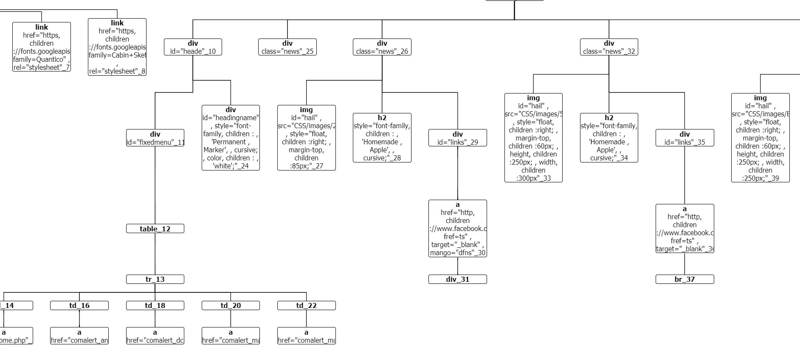

# HTML-Parser

A HTML parser to convert a html file into it's Document Object Model tree represented in JSON form
THe JSON format cn be visualized using the treant.js library

The parser warns the user if an attribute placed in a tag is not one of the valid attributes of the tag

